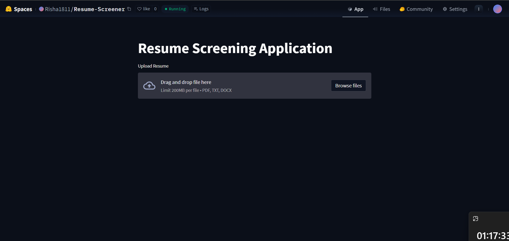
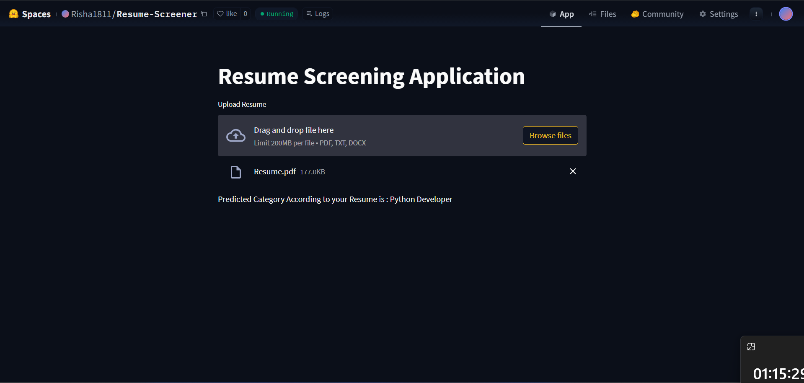

# 🚀 Resume Screening System


[](https://huggingface.co/spaces/Risha1811/Resume-Screener)

> **Automate your hiring process with AI-driven resume categorization.**

The **Resume Screening System** is a powerful machine learning application designed to streamline the recruitment process. It automatically parses, cleans, and classifies resumes into relevant job categories, helping HR teams save time and focus on the best candidates.

---

## 🌟 Key Features

*   **📄 Multi-Format Support**: Seamlessly parses resumes in `PDF`, `TXT`, and `DOCX` formats.
*   **🧹 Smart Cleanup**: Advanced NLP algorithms remove URLs, hashtags, mentions, and special characters to extract pure content.
*   **🧠 AI-Powered Classification**: Utilizes a pre-trained **K-Nearest Neighbors (KNN)** classifier with **TF-IDF** vectorization for high-accuracy predictions.
*   **⚡ Real-Time Predictions**: Instant feedback on candidate profiles via a responsive **Streamlit** interface.
*   **📊 Diverse Categories**: Capable of recognizing 20+ job profiles including:
    *   Java Developer
    *   Data Science
    *   DevOps Engineer
    *   HR
    *   Web Designing
    *   *...and many more!*

---

## 🛠️ Tech Stack

*   **Language**: Python 3.10
*   **Frontend**: Streamlit
*   **Machine Learning**: Scikit-Learn
*   **Natural Language Processing**: NLTK (Stopwords, Punkt)
*   **Deployment**: Docker

---

## 🚀 Getting Started

Choose one of the methods below to get the app running on your machine.

### Option A: Local Installation

**Prerequisites**: Python 3.10+ installed.

1.  **Clone the repository**
    ```bash
    git clone https://github.com/RISHA1811/resume-screening.git
    cd Resume-Screening-Project
    ```

2.  **Install Dependencies**
    ```bash
    pip install -r Resume-Screening-Python/requirements.txt
    ```

3.  **Run the Application**
    ```bash
    streamlit run Resume-Screening-Python/app.py
    ```

4.  **Open in Browser**
    Visit `http://localhost:8501`.

### Option B: Run with Docker 🐳

**Prerequisites**: Docker Desktop installed.

1.  **Build the Image**
    ```bash
    docker build -t resume-screener .
    ```

2.  **Run the Container**
    ```bash
    docker run -p 8501:8501 resume-screener
    ```

---

## 📁 Project Structure

```plaintext
Resume-Screening-Project/
├── Dockerfile                  # Docker configuration
├── Resume-Screening-Python/
│   ├── app.py                  # Main Streamlit application
│   ├── clf.pkl                 # Trained Classifier Model
│   ├── tfidf.pkl               # TF-IDF Vectorizer
│   ├── requirements.txt        # Python dependencies
│   ├── Upload.py               # helper script
│   └── scripts/                # Utility scripts
└── README.md                   # Project Documentation
```

## 🖼️ Preview




---

## 📜 License

This project is open-source and available under the [MIT License](LICENSE).

---

<p align="center">Made with ❤️ by [RISHA1811]</p>
